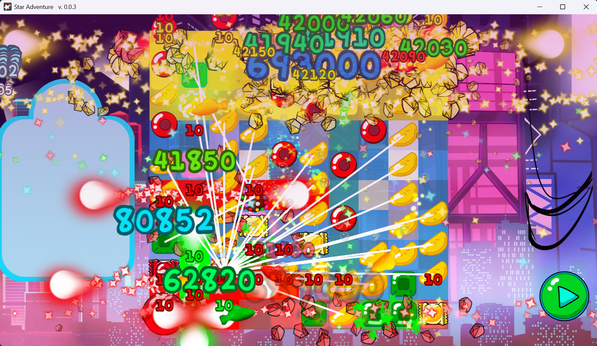

# 🌹 Rose's Adventure (Alpha 2023)

🌍 *Read this in [English](#english) | Léelo en [Español](#español)*

---

##  🇬🇧 English

A nostalgic early build of *Rose's Adventure*, originally developed in C++ using SFML.

### 📖 About This Project

This repository is a beautiful time machine. I originally started developing this game back in 2023 using C++. In 2024, the project underwent a major evolution and completely transitioned to Java. 

While the modern, active version of *Rose's Adventure* now lives in a private repository, I decided to open-source this original alpha build. The code here is far from perfect (it's raw and shows the typical growing pains of early game development) but it absolutely gets the job done. 

My hope is that by making this public, it can serve as a helpful, hands-on example for anyone who is just starting to learn programming or exploring how 2D game mechanics are built from scratch.

### ✨ Features & Tech Stack

* **Language:** C++
* **Graphics & Audio:** SFML (Simple and Fast Multimedia Library)
* **Data Parsing:** jsoncpp
* **Core Mechanics:** Basic game loops, sprite rendering, event handling, and early game logic.

---

##  🇪🇸 Español

Una nostálgica primera versión de *Rose's Adventure*, desarrollada originalmente en C++ usando SFML.

### 📖 Sobre este proyecto

Este repositorio es una hermosa máquina del tiempo. Originalmente comencé a desarrollar este juego en 2023 usando C++. En 2024, el proyecto dio un gran salto y su desarrollo hizo una transición completa a Java.

Aunque la versión actual y activa de *Rose's Adventure* se encuentra en un repositorio privado, decidí hacer pública esta primera versión alpha. El código aquí no es perfecto en absoluto (tiene los detalles típicos de cuando uno está aprendiendo a hacer juegos), pero funciona y cumple su propósito.

Mi objetivo al publicar esto es que pueda servirle a alguien que recién esté empezando a programar. Es un gran ejemplo práctico para ver cómo se construyen desde cero las mecánicas de un juego 2D.

### ✨ Tecnologías y Características

* **Lenguaje:** C++
* **Gráficos y Audio:** SFML (Simple and Fast Multimedia Library)
* **Manejo de Datos:** jsoncpp
* **Mecánicas base:** Bucles de juego (game loops), renderizado de sprites, manejo de eventos y lógica inicial del juego.
